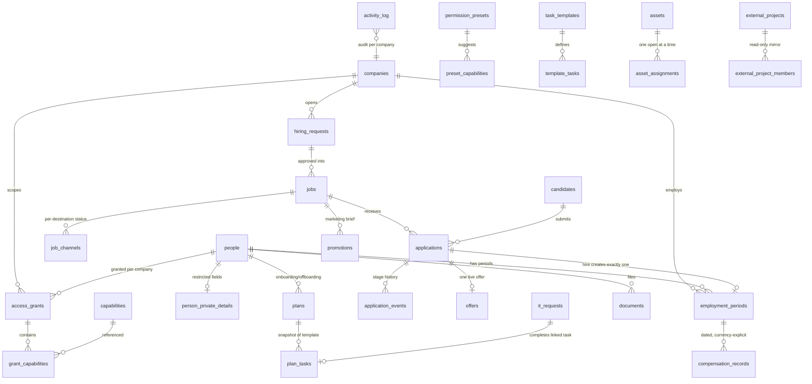

# Personnel: data model (Supabase/Postgres)

Status: designed 2026-09-10 from [the system blueprint](hr-system-blueprint.md) and
[the core HR plan](hr-product-plan.md). Implemented as SQL migrations in
`supabase/migrations/`, verified end-to-end by `supabase/tests/local-verify.sh`
(disposable Postgres container + behavioral smoke tests of the permission model),
then hardened after an adversarial security review that live-tested cross-company
attack shapes (scoped writes, candidate leakage, forged company columns,
self-approval) — those attacks are now covered by the smoke tests.

## Design principles

1. **Change data, not schema.** Everything the business will extend is a row,
   not a column or an enum: capabilities, presets, application stages,
   channels, providers, departments, locations, employment types, document
   categories, asset types, task templates, workflow owners. Adding a value is
   an `INSERT`. Code-coupled state machines (a hiring request's lifecycle, a
   task's open/done/blocked) are `CHECK` constraints instead — a new state
   there needs app logic anyway, so a migration is the honest cost.
2. **Admin-defined custom fields without DDL.** `custom_field_definitions`
   declares extra fields per entity (per company or shared); values live in
   each entity's `custom jsonb`. The UI renders and validates from the
   definitions. No migration to add "T-shirt size" to people.
3. **Identity ≠ employment ≠ account.** `people` is the person;
   `employment_periods` are dated rows per company (transfers and rehires add
   rows, never overwrite — enforced by a non-overlap exclusion constraint);
   `people.user_id` links to `auth.users` only when a login exists.
4. **The permission model lives in the database.** Capabilities (same keys as
   the prototype), presets, and per-person × per-company grants are data. Every
   RLS policy asks one question — `app.has_capability(company, cap)` — so
   tables, exports, counts, and direct URLs all enforce identical rules
   (blueprint §3). Default deny; platform admin is a separate explicit grant
   with a "never remove the last admin" trigger.
5. **External systems own their facts.** Zoho Projects and the leave system
   are mirrored read-only (`external_projects`, `leave_links`); those tables
   have **no authenticated write policies** — only the sync service role can
   write them. Integration secrets never enter these tables (Supabase Vault).

## Entity overview



## Domains (migration by migration)

**0001 foundation** — `companies` (holding + companies via `kind`/`parent_company_id`;
`settings jsonb` holds shared-defaults-with-override config), lookup tables
(`employment_statuses.counts_as_employed` declares which statuses make someone a
company member, so new statuses don't silently change access semantics),
`people`, `person_private_details` (restricted personal fields in their own
table so `personal.view` is a row-security question, not a per-column hack),
`employment_periods` (non-overlap exclusion constraint = one employing company
per person at a time), `employment_departure_details` (restricted departure
reasons, visible only to `departure.start`/`personal.view` holders — not to
plain `people.view`, not to the person), `compensation_records`
(currency-explicit; approved records cannot overlap per period).

**0002 access control** — `capabilities`, `capability_dependencies` (the
"selecting an action enables its viewing prerequisite" rule as data),
`permission_presets` + `preset_capabilities` (starting configurations — applying
a preset copies rows into the grant; later preset edits never silently change
grants), `access_grants` + `grant_capabilities` (unique per person × company),
`platform_admins` (+ last-admin trigger), and the SECURITY DEFINER helpers:
`app.current_person_id()`, `app.is_admin()`, `app.has_capability(company, cap)`,
`app.is_self(person)`.

**0003 recruitment** — `hiring_requests` (draft→submitted→changes_requested→
approved/rejected/cancelled), `jobs` (+`description_revision` so channels know
what they actually published), `job_channels` (independent per-destination
status; provider confirmation, not the click, makes it `live`), `candidates`
(recruitment identity, holding-wide, never auto-merged with `people`;
history stays company-scoped through each application's own `company_id`;
`candidate_files` beside `application_files`, at `candidate/{id}/…` in the
same private bucket), `applications`
(provider-retry dedupe via partial unique on `(job, provider, provider_ref)`;
`employment_period_id unique` = **exactly one employee can ever result from one
application** — the idempotent-hire guarantee is structural), `application_events`
(dated stage history/feedback), `offers` (one live offer per application),
`promotions` (Marketing works from the `brief` snapshot of public info, never
from candidate records — blueprint §6).

Two trigger families protect this domain: **company-sync triggers** derive the
denormalized `company_id` on `applications`/`offers`/`promotions` from their
parent row (never client-trusted; a forged value is overwritten before RLS
evaluates, so cross-company planting fails), and **transition gates** enforce
that moving a hiring request to approved/rejected requires `jobs.approve` and
never by its own requester, offers to approved/extended require `offer.approve`,
and promotions to approved / published require `marketing.approve` /
`marketing.publish` — with `decided_by`/`approved_by`/`published_by` server-set.
Service paths (no user JWT, `auth.uid()` null) bypass the gates; signed-in users
cannot.

**Outreach sub-statuses (migration 0069)** — `application_sub_statuses` (`key`,
`stage_key` referencing `application_stages`, `label`, `sort_order`,
`archived_at`) is a second recruitment lookup beside `candidate_sources`,
holding-wide, seeded only for `new` (`applied`, `sourced`,
`contact_attempted`) and `screening` (`contacted`, `interested`,
`awaiting_evaluation`, `qualified`) — the other five stages carry none, so
the blueprint's seven-stage count stands. `applications.sub_status_key` is
set by the trigger `t3_sub_status`, never by the client: on insert it reads
`source_key` (`sourced` for `head_hunt`/`linkedin_profile`/`imported`, else
`applied`); on a stage change it takes the new stage's first sub-status by
`sort_order`, or null where the stage has none. `application_events` gained
an `outreach` kind plus `from_sub_status_key`/`to_sub_status_key`, written
only by `log_outreach` — one RPC for one application or many, all-or-nothing.
"Not responding" is derived, never stored: `app.not_responding` (mirrored by
`recruitment_report`'s attention count and by `lib/outreach.ts` for the
badge) is true for an open application on a live job (`ready`/`open`/
`on_hold`) at `sourced`/`contact_attempted`/`contacted` whose last activity
is more than 30 days old, compared as UTC calendar dates.

**0004 operations** — `task_templates`/`template_tasks` (copied into plans on
assignment; editing templates never rewrites active plans), `plans`/`plan_tasks`
(critical = pre-start readiness; blocked/skipped are distinct states with
reasons), `documents` (versions supersede; binaries in Supabase Storage),
`document_requests`, `policies` + `policy_acknowledgements` (records exactly
which version was acknowledged), `assets` + `asset_assignments` (one open
assignment per asset, enforced), `it_requests` (work status independent of any
email; links to the plan task it completes — no duplicate checkbox),
`payroll_periods` (preparation/export handoff only; currency explicit per
period — payroll depth remains an open product decision).

**0005 integrations & audit** — `providers`, `integrations` (status only,
config non-secret), `external_projects`/`external_project_members` (Zoho
mirror), `leave_links` (stale sync shows as stale, never as "no absence"),
`workflow_roles`/`workflow_owners` (approvals route to a configured owner; a
NULL owner renders as *Unassigned*, approval is never skipped),
`custom_field_definitions`, `activity_log` + `app.audit()` trigger on all
sensitive tables including `integrations` and `workflow_owners` (before/after
JSON; deliberately **not** on `person_private_details` or
`employment_departure_details` — restricted PII is not duplicated into logs).

**0006 RLS** — default deny on every table. Pattern: one SELECT policy (read
reach) + one FOR ALL policy (write reach). Self-access rules give employees
their own records: own profile, own private details, own compensation, own
tasks, own documents (unless `hr_only`), own project memberships. Mutually
referencing policies (projects ↔ members) are broken with SECURITY DEFINER
helpers to avoid policy recursion — a bug the smoke test caught.

**0007 seed** — reference data only (no demo rows): the capability catalog
(keys identical to `prototype/app.js`, plus `documents.upload` and
`policies.publish`), dependencies, ten system presets (prototype's six plus
Holding HR, Recruiter, Employee, No access), stages, channels, providers,
vocabularies, and the standard onboarding template (4 critical pre-start tasks
+ day-one intro, mirroring the prototype).

**0011 company profile** — `companies` gains the typed facts documents and
payroll exports need (`legal_name`, `registration_number`, `tax_id`, address
columns, `website`, `contact_email`, `contact_phone`) plus `director_person_id`
/ `hr_contact_person_id` FKs to `people`. `brand jsonb` (reserved in 0001) now
holds `{ logo_path, accent_color, tagline }` with a check that the colour is
hex. Logos live in the public Storage bucket `company-logos` at
`{company_id}/logo-{version}.{ext}` (1 MB, image types only); storage
policies mirror the table — anyone reads, platform admins write. Archiving
(`archived_at`) is the only "delete"; every picker filters it.

## Capability → access map (summary)

| Data | Read | Write |
|---|---|---|
| Directory / employment | self, `people.view` | `employment.edit`, `departure.start` — person edits scoped to companies where the person is employed |
| Departure reasons | `departure.start`, `personal.view` | `departure.start` |
| Private personal details | self, `personal.view` | self, `personal.view` |
| Compensation | self, `salary.view` | `salary.propose` / `salary.approve` |
| Grants | self (own), `access.manage` | `access.manage` |
| Hiring requests / jobs / channels | `jobs.view` | `jobs.request`/`jobs.edit`/`jobs.approve`; publish: `jobs.publish` |
| Candidates / applications / offers | `candidates.view` via the candidate's applications, or `candidates.source` anywhere (the holding's talent pool) | `candidates.review` via applications, or `candidates.source` anywhere; creation only through `upsert_sourced_candidate`; the contact rule through `set_contact_rule`; offers also `offer.approve` |
| Promotions | `marketing.view` or `jobs.view` | `marketing.draft`/`approve`/`publish`, `jobs.edit` |
| Plans / tasks | self, task owner, `tasks.view` | task owner, `tasks.complete`, `tasks.assign` |
| Documents | self (not `hr_only`), `documents.view` | `documents.upload` |
| Policies | published: everyone in company | `policies.publish` |
| Assets / IT | self (own), `it.view` | `it.assign`, `it.complete` |
| Payroll periods | `payroll.summary` | `payroll.individual`/`approve`/`export` |
| Integrations | `integration.view` | `integration.manage` |
| Projects / leave mirrors | member/self, `projects.view` / `people.view` | service role only |
| Audit log | `access.manage` (company-scoped), admin | trigger only |

## Guarantees enforced by structure (not by app code)

- One non-draft employment period per person at a time (exclusion constraint).
- Approved compensation records never overlap per period (exclusion constraint).
- One application → at most one employee, ever (`applications.employment_period_id unique`).
- Provider retries cannot duplicate an application (partial unique index).
- One open offer per application; one open assignment per asset; one active
  plan per kind per employment period (partial unique indexes).
- The last platform admin cannot be removed (trigger).
- Read-only mirrors accept no client writes (no policies exist to permit them).
- `company_id` on applications/offers/promotions is server-derived, never
  client-supplied; a job linked to a hiring request must share its company.
- Approve/publish transitions require the matching capability, and a requester
  can never decide their own hiring request (triggers; deciders server-recorded).

## Deliberately deferred (and where it goes)

- **Richer workflow rules** (routing decisions to the configured
  `workflow_owners`, substitution rules, spending thresholds): Postgres RPC
  functions in a later migration. The essential gates — approve/publish
  capabilities and the self-approval ban — are already enforced by triggers;
  RPCs will layer routing on top, not replace the gates.
- **Supabase Storage bucket policies** for `documents`/`policies` paths — same
  `app.has_capability` questions, written when buckets are created.
- **Notifications** — `companies.settings` holds destinations; delivery is an
  integration concern, tracked honestly (drafted/sent/confirmed) per the plan.
- **Custom-field validation** — app-side against `custom_field_definitions`
  (Zod schemas generated from the definitions).
- **Secrets** — Supabase Vault only; `integrations.config` is non-secret.

## Verifying and applying

```sh
# local verification (disposable container; requires docker + psql)
./supabase/tests/local-verify.sh

# apply to a Supabase project (from the repo root, with the Supabase CLI)
supabase link --project-ref <your-project>
supabase db push
```

The shim in `supabase/tests/shim_supabase.sql` exists only to emulate the
platform (auth schema, roles) on vanilla Postgres — never run it against a
real Supabase project.
